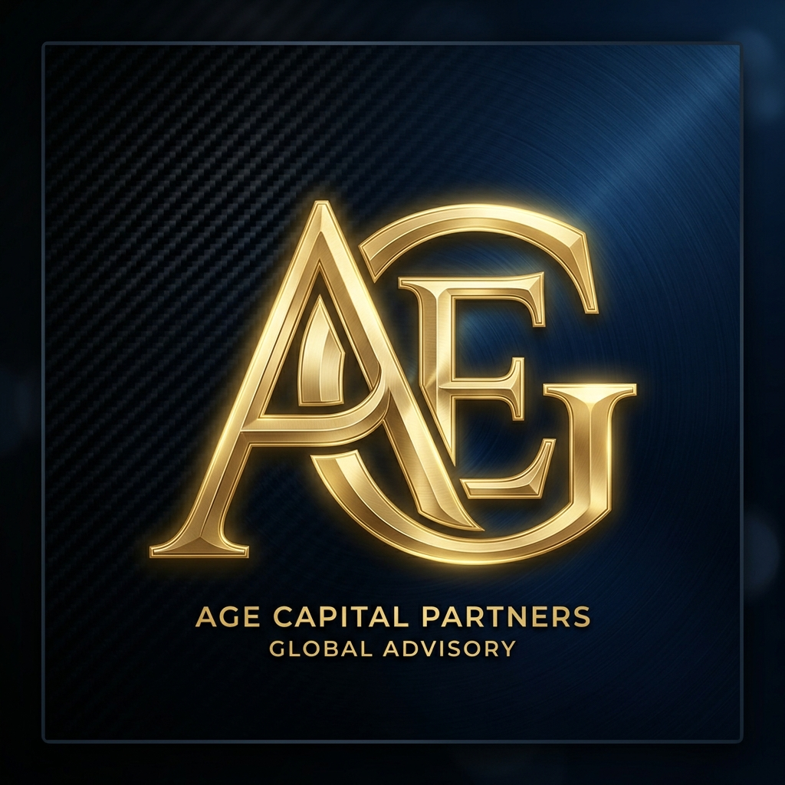
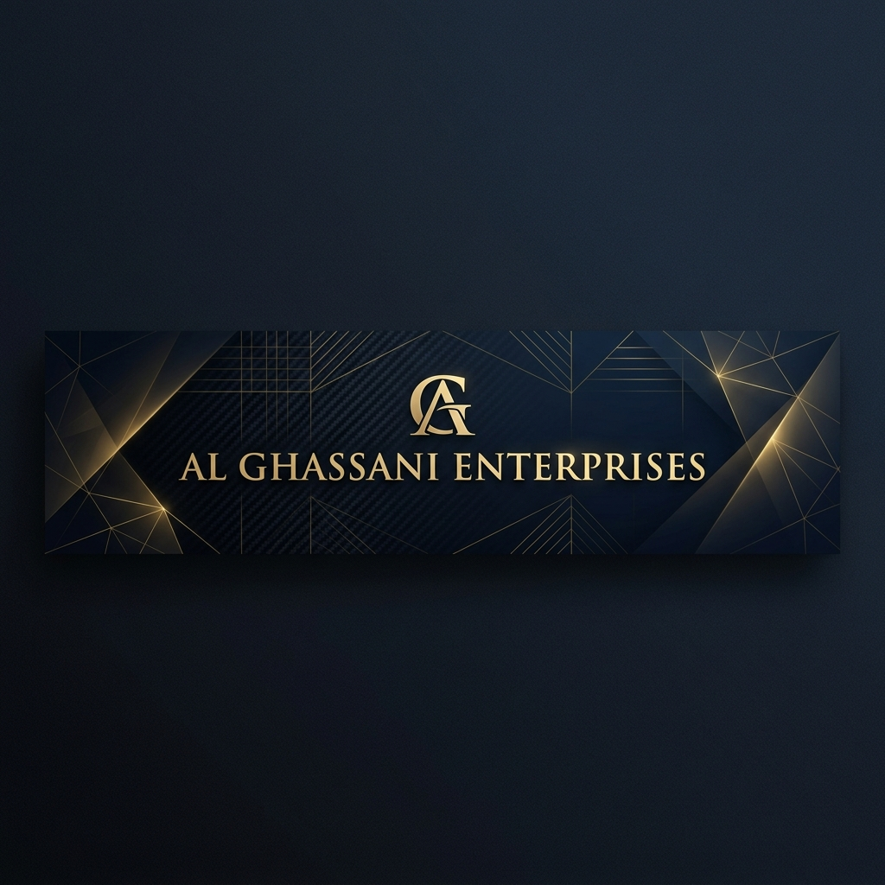

# Al Ghassani Enterprises: LinkedIn Company Page Blueprint

Use this blueprint to build a world-class, premium presence on LinkedIn. Below are your custom brand graphics and the copy-paste profile sections.

---

## 1. Brand Graphics

You can find these custom high-resolution images in the same folder as this blueprint:

* **Company Profile Photo (Square 400x400 px):**
  * Filename: [profile_logo.png](profile_logo.png)
  * Preview:
    

* **Company Cover Banner (Landscape 1128x191 px):**
  * Filename: [cover_banner.png](cover_banner.png)
  * Preview:
    

---

## 2. Company Page Identity Fields

Copy and paste these parameters during the LinkedIn company page setup:

* **Company Name:** `Al Ghassani Enterprises`
* **Website URL:** `https://alghassani.com`
* **Industry:** `Management Consulting` or `Business Consulting and Services`
* **Company Size:** `2-10 employees`
* **Company Type:** `Privately Held`
* **Tagline (Headline):**
  `Elite boutique strategic growth, regulatory compliance, and executive advisory across key GCC jurisdictions.`
* **Headquarters:** `Abu Dhabi, United Arab Emirates` (Or ADGM / DIFC)
* **Founded Year:** `2026`

---

## 3. "About Us" Profile Description (Copy & Paste)

Copy and paste this premium description in the **About** box on LinkedIn:

```text
Al Ghassani Enterprises (AGE) is an elite boutique strategic growth and executive advisory firm supporting mid-market organizations, technology innovators, and family offices in navigating cross-border expansion across the GCC.

Translating the discipline, visionary orchestration, and relationship-building philosophy of elite athletic playmaking into executive business leadership, AGE acts as a critical accelerative node for firms entering high-growth regional markets. We absorb G&A operational friction, audit regulatory files, and structure joint-venture frameworks to prepare organizations for sovereign alignments and capital raises.

Our Core Strategic Products:
• AGE Launch™: End-to-end regional setup, market diagnostics, and regulatory licensing structures in ADGM, DIFC, and GCC jurisdictions.
• AGE Connect™: Orchestrating premium corporate matchmaking, warm commercial paths, and strategic athlete brand partnerships.
• AGE Scale™: Compliance readiness, M&A advisory, and joint-venture allocations to insulate growth and secure long-term value.

Headquartered in the UAE, we operate under strict confidentiality and multi-lateral NDAs to support a highly curated roster of corporate partners.
```
